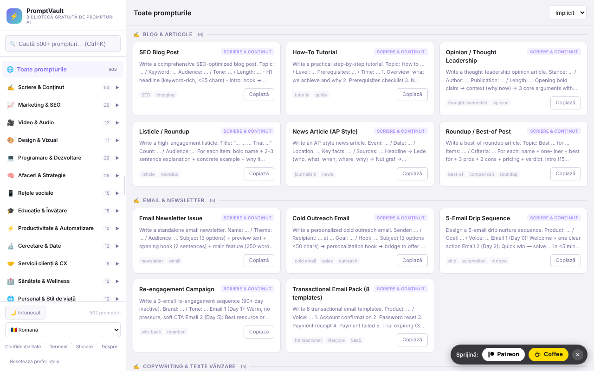

# PromptVault

Bibliotecă gratuită de prompturi AI, într-un singur fișier HTML, cu căutare, categorii și interfață în 15 limbi.

**Live:** https://chiuta.github.io/PromptVault/

## Ce este

PromptVault este o bibliotecă de prompturi pentru instrumente de inteligență artificială, organizată pe categorii (scriere, marketing, video și audio, design, programare etc.). Conform paginii „About” din aplicație, conține peste 500 de prompturi în 62 de categorii. Totul este un singur fișier `index.html`, fără cont și fără plată; promptul se copiază cu un clic și se lipește în instrumentul AI preferat.

## Funcții

- Căutare în prompturi, cu scurtătura **Ctrl+K** (sau Cmd+K) pentru a muta cursorul în câmpul de căutare.
- Navigare pe categorii și subcategorii, într-un panou lateral (pe ecrane înguste se deschide cu butonul ☰).
- Sortare: „Default”, „A→Z”, „Z→A”.
- Buton **Copy prompt** (Copiază promptul) în fereastra de detaliu a fiecărui prompt, plus buton **Copy** pe card.
- Temă luminoasă / întunecată (buton ☀️ Light / 🌙 Dark); la prima rulare se urmează preferința sistemului.
- 15 limbi de interfață: engleză, română, spaniolă, franceză, germană, italiană, portugheză, olandeză, poloneză, rusă, arabă, chineză, japoneză, coreeană, turcă.
- Panou lateral redimensionabil prin tragere sau cu tastele săgeți stânga/dreapta, Home și End când mânerul are focus.
- Ferestre informative: Privacy, Terms, Storage, About; buton **Reset** pentru ștergerea preferințelor salvate.
- Încearcă să se înregistreze ca PWA (manifest și service worker generate din cod, doar pe conexiuni securizate / HTTPS).

## Manual de utilizare

1. Deschide pagina (sau fișierul `index.html` local).
2. Alege limba din lista „Language” din bara laterală.
3. Alege o categorie din bara laterală sau apasă **Ctrl+K** și scrie un cuvânt-cheie în câmpul de căutare.
4. Opțional, schimbă ordinea cu lista „Sort”.
5. Apasă pe un card pentru a deschide promptul complet; apasă **Copy prompt** pentru a-l copia în clipboard. Dacă browserul blochează copierea, aplicația cere să selectezi și să copiezi manual.
6. Închide fereastra cu **Close**, cu ✕ sau cu **Esc**.
7. Pentru a șterge setările salvate (temă, lățime panou, limbă), apasă **Reset** din subsol.

## Confidențialitate și rețea

- **Stocare locală (localStorage):** trei chei, `pv_theme` (temă), `pv_sw` (lățimea panoului lateral) și `pv_lang` (limbă). Nu se folosesc cookie-uri. Datele nu părăsesc dispozitivul.
- **Rețea:** în codul aplicației nu există cereri către servere terțe, nici scripturi, fonturi sau imagini încărcate din exterior. Linkurile din aplicație (Patreon, Buy Me a Coffee, alexio.tf, GitHub) se deschid doar dacă le apeși.
- Service worker-ul generat local interceptează cererile GET către aceeași origine și le ține în cache, pentru reutilizare ulterioară; nu contactează alte gazde.
- Aplicația nu conține analytics sau telemetrie.

## Limitări și disclaimer

Prompturile sunt șabloane, nu sfaturi. Categoriile de sănătate, sănătate mintală, medicină, drept, contabilitate/fiscalitate, investiții/trading și asigurări sunt strict informative și nu înlocuiesc un specialist; rezultatele generate de AI trebuie verificate. O notă în acest sens este afișată în subsolul barei laterale (în engleză).

## Rulare locală / offline

Descarcă `index.html` și deschide-l în browser. Toate prompturile, textele și limbile sunt în fișier, deci funcționează fără internet. Funcția PWA/service worker necesită servire prin HTTPS (nu funcționează la deschiderea ca fișier local); linkurile externe necesită internet.

## Licență

CC0 1.0 Universal (domeniu public) — vezi fișierul LICENSE.

Notă: textele „About” și „Terms” din interfața aplicației menționează încă „Prompts: CC BY 4.0. Code: © 2026 Alexio”; această formulare urmează să fie aliniată cu declarația CC0 a repository-ului.

## Audit

Audit: 2026-10-10 — afirmațiile de rețea/stocare din README corespund codului (singurul `fetch` este în service worker-ul generat local, pentru aceeași origine; CSP `connect-src 'none'`). Licența contradictorie din pagină rămâne deschisă (vezi mai sus).

## Autor

Alexio — Alexandru-Ionuț Chiuță. Contact: alexio@trom.tf

## English summary

PromptVault is a single-file, client-side library of AI prompts (500+ across 62 categories per its About page) with search (Ctrl+K), sorting, one-click copy, light/dark theme and 15 UI languages. It stores only theme, sidebar width and language in localStorage and loads no third-party resources; external links open only on click. Works offline when downloaded; the optional PWA feature needs HTTPS. Licensed CC0 1.0.
